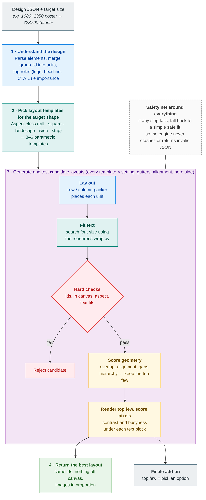

## Angelo's Ideas

```mermaid
flowchart TD
    IN["Design JSON + target size<br/><i>e.g. 1080×1350 poster → 728×90 banner</i>"]

    S1["<b>1 · Understand the design</b><br/>Parse elements, merge group_id into units,<br/>tag roles (logo, headline, CTA…) + importance"]

    S2["<b>2 · Pick layout templates for the target shape</b><br/>Aspect class (tall · square · landscape · wide · strip)<br/>→ 3–6 parametric templates"]

    subgraph S3["3 · Generate and test candidate layouts (every template × setting: gutters, alignment, hero side)"]
        direction TB
        LAY["<b>Lay out</b><br/>row / column packer<br/>places each unit"]
        FIT["<b>Fit text</b><br/>search font size using<br/>the renderer's wrap.py"]
        CHK{"<b>Hard checks</b><br/>ids, in canvas, aspect,<br/>text fits"}
        REJ["Reject candidate"]
        GEO["<b>Score geometry</b><br/>overlap, alignment, gaps,<br/>hierarchy → keep the top few"]
        PIX["<b>Render top few, score pixels</b><br/>contrast and busyness<br/>under each text block"]

        LAY --> FIT --> CHK
        CHK -- fail --> REJ
        CHK -- pass --> GEO --> PIX
    end

    OUT["<b>4 · Return the best layout</b><br/>same ids, nothing off canvas,<br/>images in proportion"]
    ADD["<b>Finale add-on</b><br/>top few = pick an option"]

    IN --> S1 --> S2 --> S3
    PIX --> OUT
    PIX -.-> ADD

    SAFE["<b>Safety net around everything</b><br/>if any step fails, fall back to a simple safe fit,<br/>so the engine never crashes or returns invalid JSON"]
    SAFE -.- S3

    classDef input fill:#eceff1,stroke:#607d8b,color:#263238
    classDef understand fill:#e3f2fd,stroke:#1e88e5,color:#0d47a1
    classDef template fill:#e0f2f1,stroke:#00897b,color:#004d40
    classDef check fill:#ffebee,stroke:#e53935,color:#b71c1c
    classDef score fill:#fff8e1,stroke:#ffb300,color:#6d4c00
    classDef output fill:#e8f5e9,stroke:#43a047,color:#1b5e20
    classDef safety fill:#fafafa,stroke:#9e9e9e,color:#424242,stroke-dasharray: 4 3

    class IN,ADD input
    class S1,LAY understand
    class S2,FIT template
    class CHK,REJ check
    class GEO,PIX score
    class OUT output
    class SAFE safety
    style S3 fill:#f3e5f5,stroke:#8e24aa,color:#4a148c
```
